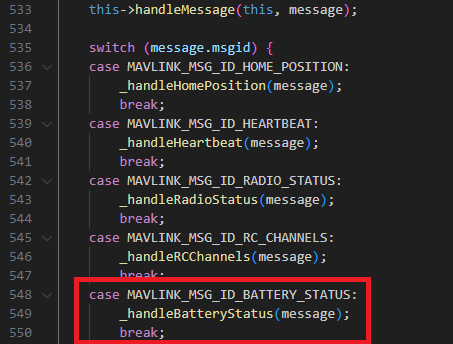
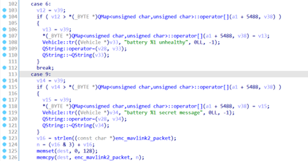
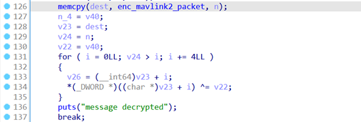
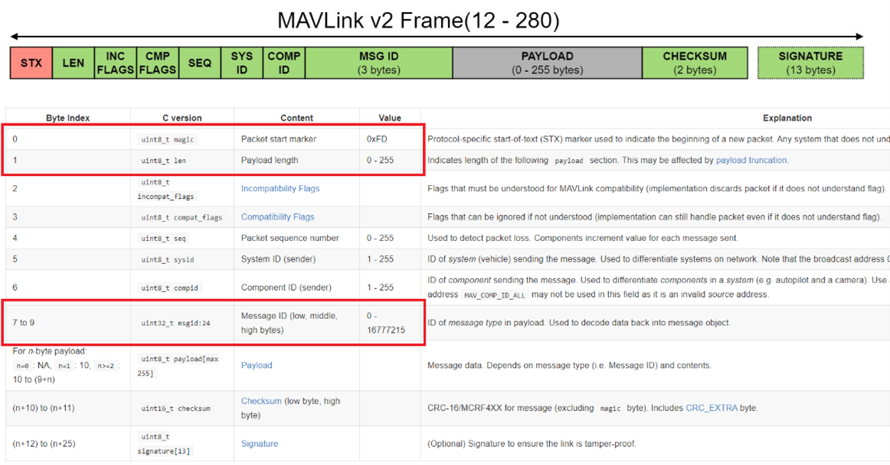
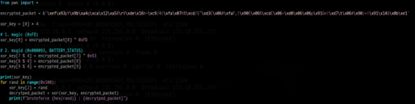
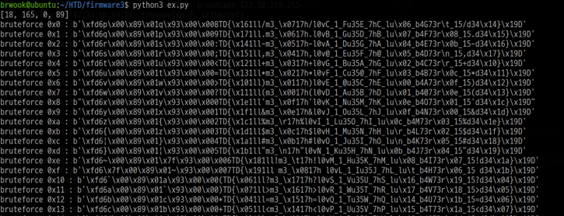
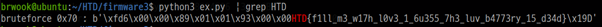

### 문제이름
Firmware-3

### 출제자
임우협

### 난이도
중

### 유형
리버싱

### 지문

> We have received confidential information that a recently deployed QGroundControl decrypts passphrases left by targets via backdoor logic. We have been told that we can focus on the `BATTERY_STATUS` packets, but we need your help.

### 풀이

1. 문제 지문을 보면, `BATTERY_STATUS` MAVLink 패킷에 플래그 관련 백도어 로직이 존재함을 유추할 수 있다. QGroundControl 레포지토리를 다운받은 뒤, 소스 코드에서 해당 문자열을 기준으로 검색 및 분석하면, `_mavlinkMessageReceived` 함수에서 전달받은 MAVLink MSGID 필드 값에 따라, 핸들링 로직이 분할됨을 알 수 있다. 그리고, `BATTERY_STATUS` 패킷은 `_handleBatteryStatus` 함수를 통해 처리됨을 확인할 수 있다.

2. 이후 제공받은 QGroundControl 바이너리를 IDA로 디컴파일한 뒤, `_handleBatteryStatus` 함수를 검색하여 해당 함수의 로직을 파악하면 된다. 소스 코드 상에서는 case 6번(`MAV_BATTERY_CHARGE_STATE_UNHEALTHY`)에서 끝나야 하는 case문에 9번이 추가로 존재함을 확인할 수 있다.

3. 로직을 분석하자면, 전달받은 `BATTERY_STATUS` 패킷의 일부 필드를 활용하여 전역 변수로 초기화된 `enc_mavlink2_packet` 문자열을 로컬 스택으로 복사한 후 XOR 연산을 수행하는 것이다.

4. 변수 이름으로부터 암호화된 메시지는 MAVLink V2 packet임을 알 수 있고, 인터넷 상에 해당 패킷의 구조는 공개되어 있기 때문에 이를 기반으로 XOR 키를 유추해야 한다. 이때, magic 바이트로부터 0xFD가 시작이어야 함을 알 수 있고, 0xFD와 암호문의 0번째 바이트를 XOR 함으로써, XOR 키의 0번째 바이트를 알 수 있다.

5. 또한, MAVLink V2 패킷이 `BATTERY_STATUS`임을 추측한다면, `Payload Length`, `Message ID` 필드로부터 XOR 키의 1번째 바이트와 3번째 바이트를 추가로 알 수 있다. XOR 키의 2번째 바이트는 구하지 못하였으나, 0x100번만 브루트포싱하면 되기 때문에 암호문 복호화가 충분히 가능하다.

6. 복호화 코드 실행 시, 여러 개의 평문을 확인할 수 있다. 그중에서 평문으로 보이는 값을 보면, MAVLink 패킷의 페이로드 부분에 플래그가 존재함을 유추할 수 있다.

7. 그중에서 “HTD”로 시작하는 문자열을 `grep`을 사용하여 추출하면, 플래그를 확인할 수 있다. 만약 풀이자가 `BATTERY_STATUS` 패킷임을 추측하지 못하였더라도, Payload 영역의 0번쨰 바이트가 “H”로 시작하는 것으로부터 나머지 XOR 키를 바로 유추할 수도 있을 것으로 보인다.

### 플래그
`HTD{f1ll_m3_w17h_l0v3_1_6u355_7h3_luv_b4773ry_15_d34d}`

### 참고자료
- https://mavlink.io/en/guide/serialization.html
- https://mavlink.io/en/messages/common.html?q=#BATTERY_STATUS
