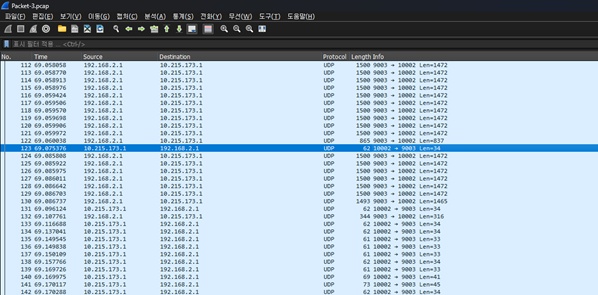
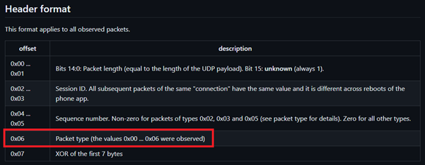
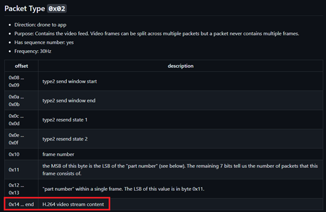
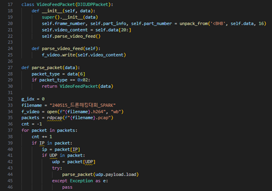
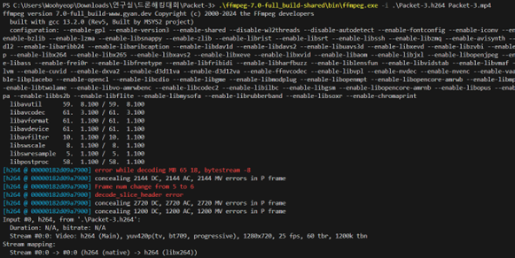
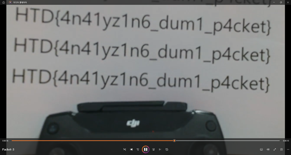

### 문제이름
Packet-3

### 출제자
임우협

### 난이도
하

### 유형
네트워크, 포렌식

### 지문

> Our brilliant technicians realized that the target was flying drones over unencrypted Wi-Fi and performed packet capture. You are now ready to extract the video feed data. You'll find video feed related content in the DJI proprietary protocol.

### 풀이

1. 문제에서 제공되는 패킷 덤프 파일을 열었을 때, UDP 패킷을 가장 많이 확인할 수 있는데, 이는 DJI 드론과 스마트폰이 Wi-Fi를 통해 직접 연결될 때, UDP 프로토콜을 사용하기 때문이다. Drone(`192.168.2.1:9003`)과 스마트폰 앱(`10.215.173.1:10002`) 사이의 통신은 UDP 프로토콜을 사용하며, App의 IP나 포트는 달라질 수 있다.

2. DUML 패킷은 UDP, DJI UDP, DUML 순서로 캡슐화되어 전송된다. 다시 말해 UDP 프로토콜과 DUML 프로토콜 사이에 DJI UDP라는 커스텀 프로토콜이 하나 더 존재한다는 뜻이다. DJI UDP 프로토콜은 `Packet Type`이라는 헤더 필드로 그 종류가 나뉘며, 총 6개의 타입이 존재한다. 해당 Protocol의 `Packet Type` 필드에 따라, Handshake/Telemetry/Video Feed/Command 패킷으로 구분되며, DUML에서는 Handshake, 비디오 피드를 제외한 Telemetry 및 Command 관련 데이터를 전달하는데 사용된다.

3. 드론에서는 주기적으로 영상 피드를 스마트폰 앱에 전달하며, 이때 DUML 프로토콜이 아닌, DJI UDP 프로토콜을 사용하여 전송한다. `Packet Type`이 0x2일 때, H.264 코덱으로 인코딩된 비디오 스트림 데이터를 확인할 수 있다.

4. 따라서, DJI UDP 패킷 덤프에서 DJI 영상 피드 데이터를 모아 하나의 파일로 저장한다. 이때, 각 비디오 프레임이 암호화되어 있지 않기 때문에, 단순히 각 영상 프레임을 그대로 조합할 수 있다. 

5. FFmpeg는 오디오 및 비디오를 녹화 및 변환하는 오픈소스 소프트웨어로, 다양한 코덱을 지원하는데 H.264 코덱또한 지원하기 때문에 수집한 동영상 프레임을 해당 코덱에 맞게 디코딩할 수 있다.

6. 디코딩된 동영상을 재생할 경우 플래그를 확인할 수 있다.

### 플래그
`HTD{4n41yz1n6_dum1_p4cket}`

### 참고자료
- https://github.com/samuelsadok/dji_protocol/blob/master/udp_protocol.md
