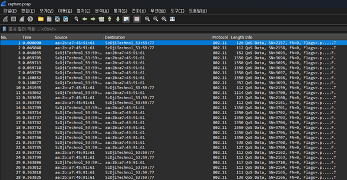
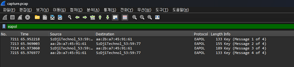
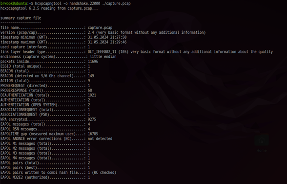
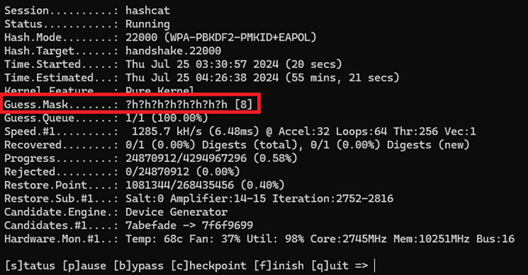
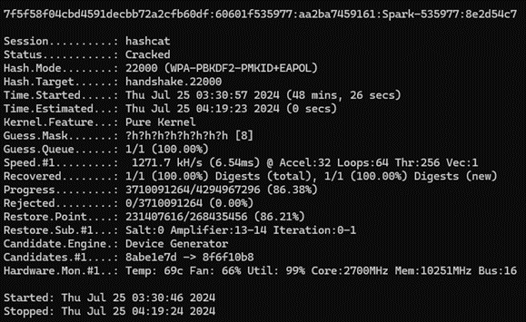
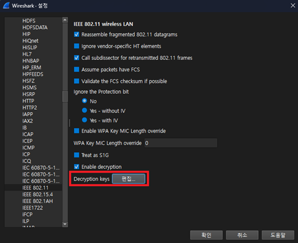
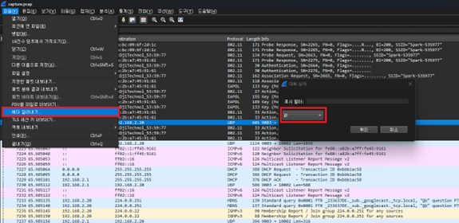
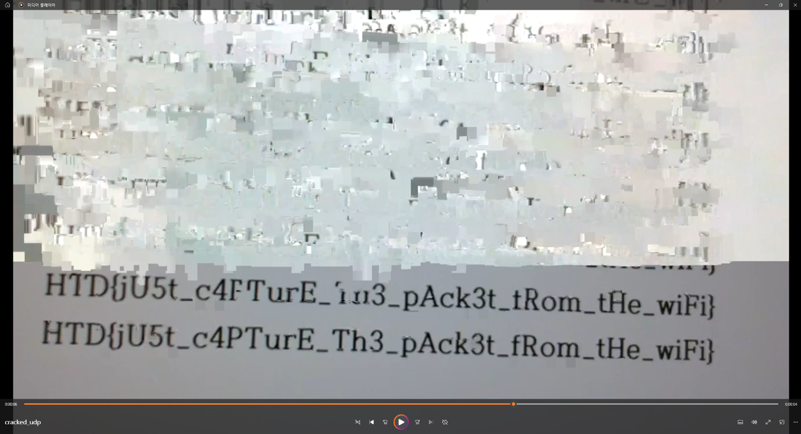

### 문제이름
Packet-4

### 출제자
임우협

### 난이도
중

### 유형
네트워크, 포렌식

### 지문

> Once again, our fine technicians have realized that the target is flying a DJI SPARK drone over Wi-Fi and have captured the packets. You're ready, it's time to extract the video feed data.
> 
> (The Wi-Fi password for DJI SPARK drones is supposed to be at least 8 alphanumeric characters.)

### 풀이

1. 동일 네트워크에 속한 상태에서 주고 받은 패킷을 캡처하였기 때문에 암호화되지 않은 UDP 패킷에 대한 덤프를 기반으로 동영상 피드 데이터를 추출했던 Packet-3 문제와 달리, 이 문제는 동일한 네트워크에 속하지 않은 공격자 입장에서 패킷 캡처를 수행하였기 때문에 IEEE 802.11 프로토콜까지만 확인 가능하다. WPA2-PSK 방식의 암호화를 사용하고 있기 때문에, 이러한 암호화를 해제하여야 한다. 그런 다음에는 Packet-3 문제와 동일하게 풀이 가능하게 된다.

2. 제공된 패킷 덤프 파일을 Wireshark를 통해 열었을 때, 그림과 같이 WPA2 handshake 정보 (EAPOL 패킷)을 확인할 수 있다. Deauthentication 공격이 발생하면 클라이언트는 일시적으로 AP와 연결이 끊기고 다시 4-way handshake를 시도하는데, 이때 EAPOL 패킷이 교환되고 이를 캡처한 것이다. 저장된 EAPOL 패킷을 사용해 브루트포싱하는 비밀번호를 검증할 수 있기 때문에, 이 패킷이 캡처되지 않았다면 해당 패킷 덤프는 복호화할 수 없다.

3. hcxpcapngtool (hcxtools)를 통해, 패킷 덤프로부터 4-way handshake 및 PMKID 정보를 추출하고, 이를 비밀번호 크래킹 도구에서 활용 가능한 형태로 변환한다.

4. 이후 비밀번호 크래킹 도구인 hashcat을 활용하여 브루트포스 공격을 수행한다. hashcat은 GPU를 활용하여 빠른 속도로 패스워드 크래킹을 할 수 있기 때문에, GPU가 좋을수록 보다 빠르게 수행된다. 문제 지문에 소개되었듯이, SPARK 드론의 와이파이 비밀번호는 8자 이상의 영숫자로 구성되어 있기 때문에, 16진수 문자를 나타내는 “?h”를 8번 사용함으로써, 8자리의 영숫자 브루트포싱을 진행한다.

5. 브루트포싱을 통해 알아낸 비밀번호를 Wireshark에 적용함으로써 암호화되어 있던 IEEE 802.11 패킷을 복호화할 수 있다. Ctrl + Shift + P를 누르고, Protocols > IEEE 802.11 > Decryption Keys에서 편집 버튼을 누른다. 이후, Key type에서는 wpa-pwd를 세팅하고, Key에는 크랙한 비밀번호를 입력한다.

6. 설정을 마치고 나면 EAPOL 패킷 송수신을 통한 4-way handshake 이후의 패킷들은 평문으로 복호화된 것을 확인할 수 있다. 그러나, Packet-2에서 사용하였던 코드를 적용하기 위해서는 UDP 패킷이 보이도록 pcap 덤프를 패치해주어야 하기 때문에, 파일 > 헤더 잘라내기 탭에서 IP를 설정함으로써, IP 프로토콜보다 상위에 있는 IEEE 802.11을 잘라내고 그대로 평문을 확인할 수 있다.

7. 이렇게 만들어진 평문 패킷 덤프에 Packet-2 때 작성하였던 풀이 코드를 적용함으로써, 동일하게 영상 피드 데이터를 추출할 수 있게 된다.

### 플래그
`HTD{jU5t_c4PTurE_Th3_pAck3t_fRom_tHe_wiFi}`

### 참고자료
- https://github.com/samuelsadok/dji_protocol/blob/master/udp_protocol.md
